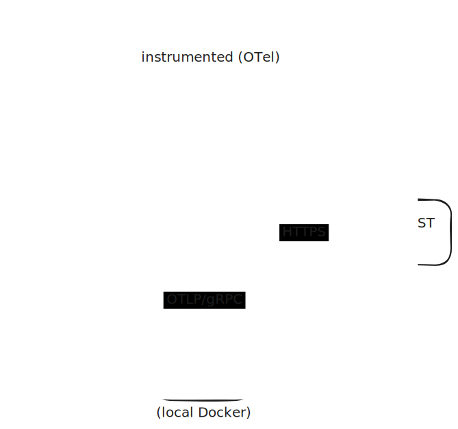

# Clio MCP Server

MCP server that exposes [Clio's](https://www.clio.com/) practice management API as tools for AI assistants.

> 🚧 Under active development

## Quick start

```bash
uv sync
cp .env.example .env
# Fill in your Clio API credentials and Anthropic key
uv run clio-mcp
```

## Tools

_Coming soon_

## Architecture



MCP clients connect to the server over stdio. The server exposes Clio's REST API as typed tools backed by `ClioClient`, an httpx-based wrapper. OpenTelemetry auto-instrumentation on FastMCP and httpx exports spans to a local Arize Phoenix instance for tracing.

## Evals

A standalone harness under `evals/` uses the Anthropic SDK as an MCP client. Per case it runs an agent loop against the live server, captures the trajectory, and scores it. Separate from `tests/` and from the server itself.

**Scoring.** Four columns per case:

- `TOOL` — agent selected the expected tool
- `ARGS` — call args contain the expected subset
- `RESULT` — expected non-null fields are present and populated on the tool response (catches sparse-fields bugs where a 200 returns a nulled-out body)
- `DONE` — agent terminated cleanly

`ARGS` and `RESULT` are vacuously true when the expectation set is empty.

**Cases.** Four, covering list and get-by-id across both resource types: `search_matters_generic_term`, `search_contacts_company`, `get_matter_by_id`, `get_contact_by_id`.

**Run.**

```bash
uv run --group evals python -m evals.harness
```

Table goes to stdout; full per-run JSON persists to `evals/runs/`.

**Latest run** (2026-04-28):

| Case | TOOL | ARGS | RESULT | DONE |
| --- | --- | --- | --- | --- |
| `search_matters_generic_term` | PASS | PASS | PASS | PASS |
| `search_contacts_company` | PASS | PASS | PASS | PASS |
| `get_matter_by_id` | PASS | PASS | PASS | PASS |
| `get_contact_by_id` | PASS | PASS | PASS | PASS |

## Contributing / Local setup

```bash
uv sync --group dev          # install dev dependencies (includes pre-commit)
uv run pre-commit install --hook-type pre-commit --hook-type commit-msg

cp .client-names.example .client-names
# Edit .client-names to list client names the hook should block.
```

The `block-client-names` pre-commit hook reads `.client-names` (gitignored) and refuses commits that contain any listed name as a case-insensitive whole-word match. The denylist is per-clone and must be populated locally; `.client-names.example` documents the format. The hook is defense-in-depth — see the confidentiality section of `CLAUDE.md` for the broader rules.

## Data handling

This server runs locally over stdio; no data transits through any infrastructure operated by this project's author. Tool responses flow from the Clio API to the local process to the user's Claude client, subject to that client's data handling terms. Observability is via self-hosted [Arize Phoenix](https://phoenix.arize.com/); traces do not leave the user's machine.